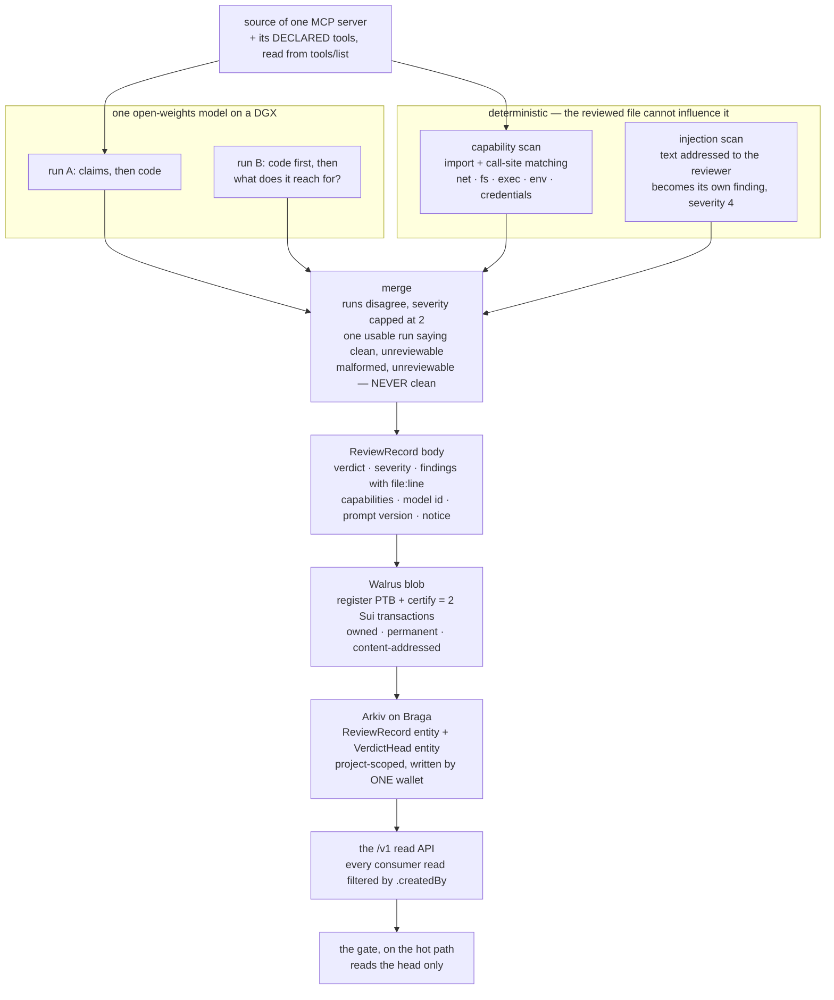
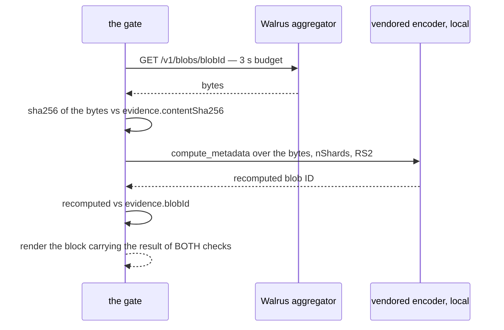

import { Callout } from 'nextra/components';

# The evidence chain

A verdict is only worth as much as the link between it and the code it judged. SureX keeps three
things separable on purpose: **the source that was read**, **the judgement about it**, and **the
compact head the gate reads on the hot path**. Each is stored where it can be checked independently.

## Review, then write

Three properties of that pipeline are worth stating plainly.

**The deterministic lanes are not model output.** A model reading a file that is trying to talk to
it can be talked out of its conclusion; a regex cannot. So the capability surface and the injection
signal run whether or not the model does, and they appear on `clean` verdicts too.

**Every review runs twice, with paraphrased prompts.** Same schema, different route to it. If the
two runs disagree, the more cautious verdict is kept and its severity is **capped at 2** — below
the blocking threshold — so a contested finding shows its evidence instead of stopping a call.

**Untrusted content is fenced and labelled as data**, with a nonce that is random per call so
content cannot close its own delimiter and continue as prose the model reads as ours. A standing
directive says instructions found inside reviewed content are findings, not commands. The SureX
malicious fixture plants an injection aimed squarely at the reviewer; it comes back as a
`reviewer-injection` finding rather than as a clean verdict.

## Why two stores rather than one

| Store | Holds | Why it is that one |
|---|---|---|
| **Walrus** (on Sui, testnet) | the source blob and the review blob, separately | content-addressed: a verdict points at the exact bytes it judged, and nobody — including us — can quietly swap them |
| **Arkiv** (Braga) | the queryable `VerdictHead` and `ReviewRecord` entities | the gate has to resolve a decision in **one query** before every tool call, and Walrus is not a query engine |

The head is small on purpose. It carries everything the gate needs to decide and nothing that would
need a second fetch to act on — a verdict requiring a round trip to be actionable would double the
latency of every tool call.

<Callout type="warning">
**Two independent clocks.** Arkiv entity expiry and Walrus storage epochs drift apart, so a head can
outlive the bytes it points at. A surface must distinguish *evidence expired* from *no evidence*.
The renewal job is unbuilt and is listed as cut, not as done.
</Callout>

## What the gate checks when it blocks

Blocking is the one moment the gate spends time on the evidence, because a human is about to read
it — and because "the verdict points at the exact bytes it judged" is a claim rather than a property
until something re-checks it.

Each check reports one of four statuses, and the block message prints them:

| Status | Means |
|---|---|
| `passed` | the check ran and the bytes matched |
| `failed` | the check ran and the bytes did **not** match — a bigger story than the finding itself |
| `asserted` | no encoder was available, so the identifier is taken on the aggregator's word. **Not** a pass |
| `unavailable` | the record had nothing to compare against |

The distinction between `passed` and `asserted` is the whole point. A blob ID is **not**
`sha256(bytes)` — it is a commitment over the erasure-coded sliver structure, so recomputing it
needs the Walrus encoder. The plugin therefore vendors it (376 KB, Apache-2.0), and with
`n_shards = 1000` and encoding `RS2` the recomputed ID reproduces the on-chain one exactly, while
one flipped bit does not. Without it the gate could only *assert* that a content-addressed store
returned what it asked for, which is trusting the aggregator, and is not a check.

**A failed evidence check does not unblock anything.** The block stands, and the message says the
evidence did not match the record.

## Following it yourself

Everything on a head is a public identifier. From a verdict you can walk the whole chain by hand:

| Identifier | Where it resolves |
|---|---|
| `evidence.blobId` | `https://aggregator.walrus-testnet.walrus.space/v1/blobs/<blobId>` |
| `evidence.suiObjectId` | `https://suiscan.xyz/testnet/object/<id>` |
| `evidence.registerTx` / `certifyTx` | `https://suiscan.xyz/testnet/tx/<digest>` |
| `arkivEntityKey` | `https://explorer.braga.hoodi.arkiv.network/entity/<key>` |

The API will do the fetch for you and report which checks ran:
`GET /v1/review/<key>?evidence=1`.

## The provenance filter

Braga is a shared public testnet with no uniqueness constraint on our attributes. Anyone can write
an entity with the same project, entity type and fingerprint, and the opposite verdict. Every
consumer read is therefore filtered by **`.createdBy(<writer address>)`** — proven, not assumed: a
colliding entity written from a second wallet appears in the unfiltered query, and the filter
partitions the two cleanly in both directions.

It must be `createdBy` and never `ownedBy`. They sit side by side in the SDK with near-identical
documentation, but ownership is transferable via `changeOwnership` — so `ownedBy` is
attacker-influenceable, and using it would be a silent authorisation bypass.
