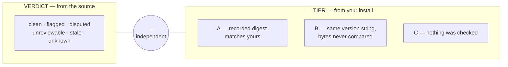
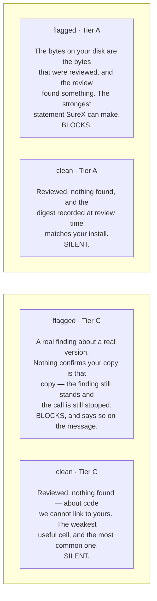

import { Callout } from 'nextra/components';
import { TierSentences } from '../../components/contract.tsx';

# Verdict ⊥ Tier

Read this before you read anything else about a verdict. Every entry in the registry carries two
values that look like one score and are not:

|  | **Verdict** | **Tier** |
|---|---|---|
| Answers | *What did the review find?* | *Is the reviewed code your code?* |
| Values | `clean` `flagged` `disputed` `unreviewable` `stale` `unknown` | `A` `B` `C` (and `MISMATCH`) |
| Comes from | the **source** that was reviewed | your **install configuration**, on your machine |
| Decides | whether the gate blocks | how much the verdict is allowed to claim about you |

**They are orthogonal.** Neither constrains the other. The most common way to misread SureX is to
collapse them into one axis — to hear "Tier C" as "we do not really know" and discount a real
finding, or to hear "flagged" and assume somebody confirmed it is the code on your disk.

## The matrix

Every cell is reachable. The four corners are the ones worth naming.

<Callout type="info">
**Tier C is the normal case today, not a defect.** On the first real machine the gate was run
against — a working developer's laptop, fifteen MCP servers across three config scopes — **every
single stdio server resolved to unpinned**, because the ecosystem convention is `npx -y pkg@latest`.
All fifteen were Tier C. Tier A is implemented and real; as of this writing it is close to
unreachable in the ecosystem as it exists. SureX grades it C and says so on the verdict rather than
letting silence read as a pass.
</Callout>

## What each tier actually promises

These sentences are not paraphrases. They are the output of `tierSentence()` in
`packages/core/src/verdict.mjs`, rendered here by calling it:

<TierSentences />

`MISMATCH` is the interesting one: the published artifact for that exact version changed after the
review. It is a **downgrade and a warning, never a block** — far more often a registry quirk or a
local rebuild than an attack.

## Where the tier comes from

Only the gate can compute it, because only the gate can see your machine. `resolveTier()` in
`packages/plugin/lib/gate.mjs` compares the `integrity` digest recorded at review time against the
one in your local install:

| Your install config | Tier | Why |
|---|---|---|
| `npx -y @acme/mcp@1.4.2`, and npm `dist.integrity` matches the recorded one | **A** | the reviewed bytes are the installed bytes |
| `npx -y @acme/mcp@1.4.2`, no local digest to compare | **B** | same version string, bytes never compared |
| `npx -y @acme/mcp@latest` — unpinned | **C** | the version resolves to whatever is newest today |
| a remote HTTP endpoint | **C** | there are no local bytes at all |
| `node ./server.js` — a local script | **C** | identity is the entry file's content; the module graph behind it is not covered, and there is no published artifact to compare against |
| `uvx`, `docker`, a git install | **B** at best | only npm `dist.integrity` is implemented; the others are labelled, not implied |

## A remote endpoint is Tier C — it is not automatically unreviewable

This is the distinction that motivated the page. A remote MCP server loses the **byte linkage**,
because there is nothing on your disk to compare. It does **not** lose the **review**: if its source
is published, it can carry a real `clean` or `flagged` verdict like anything else. Tier C and
`unreviewable` are answers to different questions, and only one of them is about your machine.

## How to say it

> `flagged`, Tier C — an automated review of the published source of this version found a
> critical mismatch. Nothing checks that the copy on your machine is that copy.

Not "SureX is not sure". SureX is exactly as sure as it says, on each axis separately.
