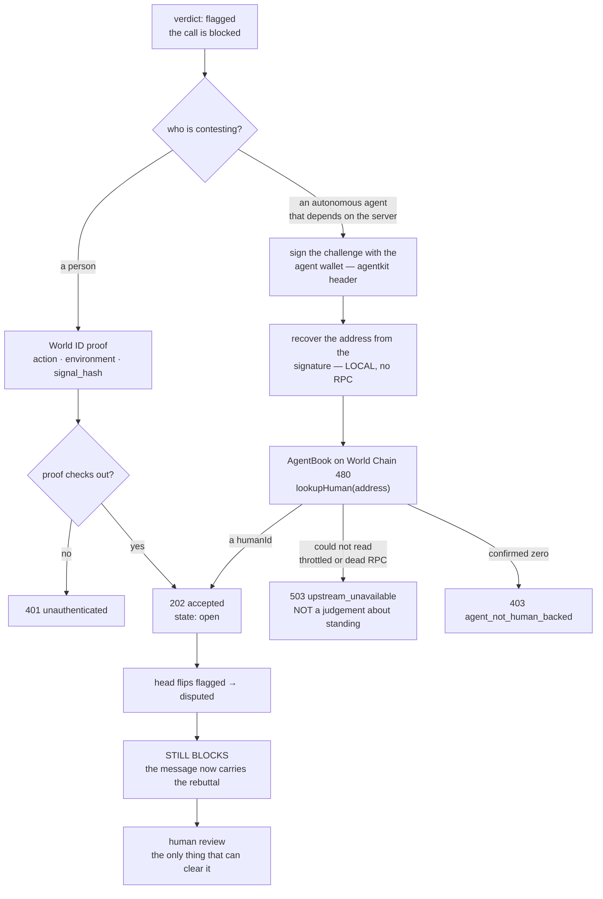

import { Callout } from 'nextra/components';

# Dispute a verdict

Reviews are automated and no human audits them, so the model can be wrong. The appeal exists for
that reason. Two things about it are fixed and neither is negotiable:

1. **A dispute never unblocks anything.** `disputed` blocks exactly as `flagged` does; only the
   wording changes, and only a human overturn produces a `clean` head.
2. **A dispute needs standing.** Not agreement — standing. Someone or something has to be
   accountable for the claim, or the appeal queue is a spam target.



## The human path

A person proves personhood with World ID. `contest-verdict` allows **N per rolling window** (five
per 24 h by default) rather than one per person ever — being right twice is not a sybil, and a
one-shot appeal would silence a maintainer who is genuinely wrong about the first one but right
about the second.

The proof is checked before it is forwarded: the action must match this route's action, the
environment must match the deployment's, and `signal_hash` must equal the hash of the signal this
request implies — so one proof cannot be replayed across the registry. Then the proof payload goes **byte-for-byte** to World's verify endpoint.
Only the nullifier is retained.

## The agent path — the novel one

An autonomous agent that depends on a blocked server can contest the verdict itself, without a
human in the loop at request time. What gives it the right to be heard is that **a human registered
this agent's wallet in World AgentBook**.

Send the request. With no signature you get a `401` carrying the challenge to sign — this is the
real response from the live API:

```jsonc
{
  "error": {
    "code": "unauthenticated",
    "message": "the request carried no usable proof of who is asking. That is a different claim from \"no human stands behind this agent\" — nothing has been decided about standing.",
    "reason": "agentkit_header_missing",
    "challenge": {
      "agentkit": {
        "info": {
          "version": "1",
          "uri": "http://arkiv-surex-api.vercel.app/v1/disputes",
          "domain": "arkiv-surex-api.vercel.app",
          "statement": "Contest a SureX verdict. Signing proves a human registered this agent in AgentBook; it grants standing to be heard, not agreement.",
          "nonce": "…",
          "issuedAt": "…",
          "expirationTime": "… (5 minutes)"
        },
        "supportedChains": [
          { "chainId": "eip155:480", "type": "eip191" },
          { "chainId": "eip155:480", "type": "eip1271" }
        ]
      }
    }
  }
}
```

Sign it and retry with the signed payload in an **`agentkit`** request header:

```bash
SUREX_AGENT_PRIVATE_KEY=0x… node scripts/agent-dispute.mjs \
  --api https://arkiv-surex-api.vercel.app --fp sxf1_…
```

<Callout type="warning">
**Sign the `uri` and `domain` exactly as the challenge states them, scheme included.** The resource
URI is derived from the `Host` header, so behind a TLS-terminating proxy the challenge can name
`http://…` while you reached the API over `https://`. The server compares against what it derived,
so a signature over the "obviously correct" `https://` form is refused. A deployment can pin it with
`SUREX_RESOURCE_URI`.
</Callout>

### Five things measured on the way in, that will cost you time otherwise

- **The header is `agentkit`, not `x-payment`.** Undocumented; read out of the SDK. Classifying on
  the wrong header made a correctly signed agent get refused as a human with no World ID proof.
- **`agentkit.fetch` silently does nothing** against `@x402/hono@2.19`: it reads the challenge from
  the response body, and x402 2.19 puts it in a base64 `payment-required` header and leaves the body
  `{}`. No signature, no retry, no error, no event. Use `agentkit.createHeader()` and retry by hand.
  SureX serves its challenge in the body of the 401 for this reason — and because this is identity,
  not payment: nothing is priced and nothing is charged.
- **`lookupHuman()` swallows every error and returns `null` — and `null` is the deny signal.** A
  dead RPC, a 429, a wrong address and a bad checksum all return exactly what an unregistered agent
  returns. SureX never believes a `null`: it re-reads through its own viem client where a transport
  failure actually throws, and only a **confirmed on-chain zero** becomes `403`. An agent must never
  be told no human stands behind it because our RPC was throttled.
- **The signature is recovered locally.** For `eip191` the address comes from
  `recoverMessageAddress()` — no RPC — so no network condition can turn a good signature into a
  rejected agent. An `agentAddress` in the body is a **claim**; if it disagrees with the signature,
  the signature wins and the request is refused.
- **Bind the signature to this rebuttal with `requestId`.** The AgentKit message covers domain, uri,
  nonce and time — not your evidence — so without it a captured header could file a *different*
  dispute until the nonce expires.

### What standing is, exactly

AgentBook returns an **anonymous human id and nothing else**. No call volume, no history, no score.
One human may register many agents and they all return the same id. So standing means precisely one
thing: *a human registered this wallet*. It is not a statement that the rebuttal is right, and it is
never a rating of the agent — SureX reviews **servers**.

<Callout type="info">
**Registering an agent needs an Orb-verified World ID**, because the contract checks `groupId = 1`
and only Orb credentials exist on chain. Registration itself is gasless — a hosted relay pays, and
the agent wallet needs no balance on any chain. **Reading** AgentBook needs nothing, which is why
the whole gate is exercisable today even from a machine that has never registered anything.
</Callout>

## Status, stated plainly

**The agent path is live, end to end, both ways.** Against the deployed API: a registered agent gets
`202` with AgentBook standing and the head moves `flagged → disputed` — still blocking — while a
wallet nobody registered gets an honest `403`. SureX's own agent wallet is registered on World Chain
480; `lookupHuman` returns a non-zero human id for it.

Getting there took one wait that was not a bug in anything: registration reverted `NonExistentRoot()`
for a while because World Chain's identity tree had not yet bridged the Orb proof's root. The proof
was valid the whole time. It cleared when the bridge advanced, with no change on this side — worth
knowing if you hit the same revert, because it looks exactly like a rejected proof and is not one.

The human path is built and **not provable yet** on this deployment: it needs a World Developer
Portal relying party. Until it is set, every human dispute fails with an explicit configuration
error that says it is *our* misconfiguration and not a judgement about the contestant. Never a pass.

## What acceptance returns

```jsonc
{
  "status": "accepted",
  "dispute": { "id": "sxd1_…", "state": "open", "contestantType": "agent",
               "standing": { "humanId": "…" } },
  "enforcement": "unchanged — a disputed verdict still blocks; only a human overturn produces a clean head",
  "headTransition": { "from": "flagged", "to": "disputed", "appliedBy": "worker" },
  "persisted": false
}
```

`enforcement` is spelled out in the response so no client implements the wrong one. `persisted:
false` and the absence of any entity key or transaction digest are deliberate: the read API has no
wallet and cannot write, so it returns nothing that would imply it did.
