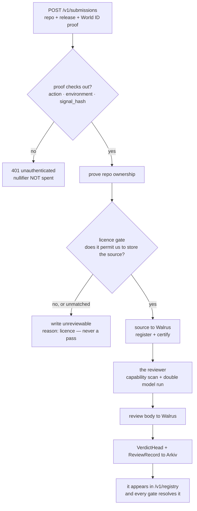

import { Callout } from 'nextra/components';
import { StatusLine } from '../../components/status.tsx';

# Submit a server

<Callout type="warning">
**Read this before you spend a proof.** <StatusLine of="submissions" /> This is stated here rather
than discovered at the end of a form.
</Callout>

## The endpoint

```http
POST /v1/submissions
```

```jsonc
{
  "repo": "https://github.com/acme/mcp-tools",
  "release": "2.1.0",
  "proof": { /* the IDKit result, unmodified */ }
}
```

Responses you can actually get today:

| | |
|---|---|
| `400 invalid_body` | `a submission names a repo and a release` |
| `401 unauthenticated` | the World ID proof did not check out |
| `500 internal` | this deployment has no World ID relying party configured. **Our misconfiguration, never a pass** |
| `501 not_implemented` | the proof was accepted and the ingest pipeline is not built |

The World ID gate runs **first** and for real: no proof, a wrong action, or a staging proof against
a production deployment never reaches the pipeline at all. A staging proof is a simulator identity,
and a production deployment refuses it before it is ever forwarded.

## Why a proof of personhood at all

Submission is one per person, ever. Without an anti-sybil gate, the cheapest attack on a review
registry is not to defeat the reviewer — it is to submit ten thousand configurations and drown the
queue, or to submit a benign copy of a server you control and let the resulting entry speak for the
malicious one. World ID makes the cost of a submission a person rather than a request.

Only the **nullifier** is retained, stored as a decimal string. Nothing else about the person is
kept.

## What submission is meant to do, once the ingest half lands



Three of those boxes are guardrails rather than steps, and they already exist in code:

- **The licence gate only reviews what we are allowed to store.** An unmatched custom licence is
  treated as ineligible, not as a maybe — guessing wrong writes someone's code to storage that has
  no delete.
- **`clean` is never written without a real review.** A transport failure, a malformed model
  response, or one usable run out of two is `unreviewable` with its reason.
- **Nothing that is not a SureX fixture is ever publicly flagged** on the strength of an unaudited
  model verdict. The publishing script carries that guard explicitly so it cannot be pointed
  elsewhere.

## Until then

Two things are worth doing today if you maintain an MCP server:

**Pin your published versions, and publish an integrity digest.** Tier A is implemented. It is
unreachable in practice only because the ecosystem convention is `npx -y pkg@latest`. A pinned
version with an npm `dist.integrity` your users' installs can be compared against is the difference
between a verdict about "some version of this package" and a verdict about *their bytes*.

**Read what a review can and cannot see** before you assume a `clean` verdict would say what you
want it to say. It does not cover your dependency tree, which is where the actual attacks live.

## Where the code is

`apps/api/src/app.mjs` for the route, `apps/api/src/verifiers.mjs` for the identity seam,
`packages/worker` for the write side that needs the wallet this API deliberately does not have.
