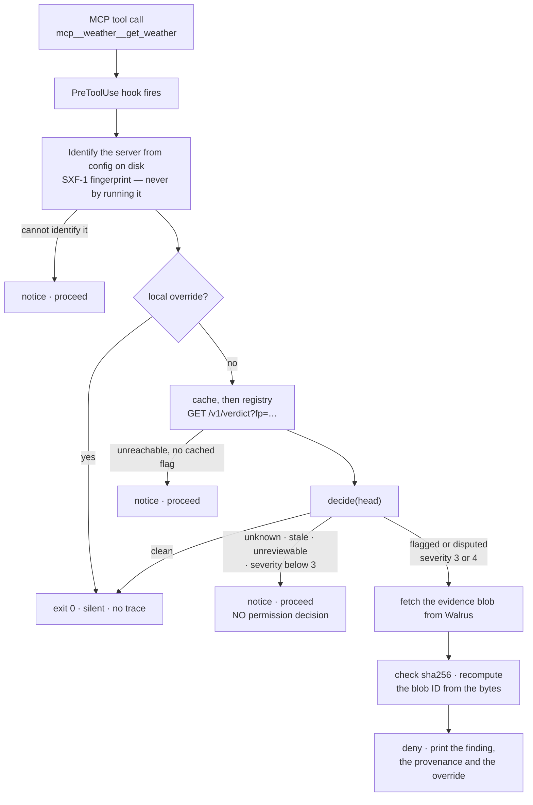

import { StateList } from '../components/contract.tsx';
import { KnownGaps, StatusLine, VerifiedOn } from '../components/status.tsx';

# A gate on MCP tool calls

Adding an MCP server to a coding agent is a leap of faith. The server runs with your agent's
permissions, sees your files and your credentials, and **nothing checks it before a tool call
executes**. There is no moment between "the model decided to call this tool" and "the tool ran"
where anything looks at what the server actually does.

**SureX puts a check in that moment.** It is two things: a public registry of automated reviews of
MCP servers, and a Claude Code plugin whose `PreToolUse` hook looks the server up before any
`mcp__*` tool call runs. Reviewed with nothing found → the call proceeds silently and you never
notice. Flagged → the call is **blocked**, you are shown the finding, the file, the line and what
the code can reach, and one command lets you proceed anyway. Anything else — unknown, stale,
registry unreachable → a one-line notice and your normal permission flow decides, exactly as it
would without SureX installed.

<StateList />

## The gate, on every tool call

Two properties of that diagram are the whole design, and both are covered in
[Fail open, never fail unsafe](/concepts/failure-posture):

- **The warn path emits no permission decision.** A hook that answers `allow` *grants* the call
  outright, so emitting it on `unknown` would auto-approve exactly the servers SureX knows nothing
  about — strictly worse than not installing it.
- **A cached flag keeps blocking with no network at all.** A blip must not un-flag a server already
  known to be bad.

## Where a verdict comes from

A verdict is one review by an open-weights model plus a deterministic capability scan the reviewed
file cannot influence. The review body is written to **Walrus** as a content-addressed blob; a
compact head that points at it is written to **Arkiv** (Braga), and that head is the only thing the
gate reads on the hot path. When the gate blocks, it fetches the blob and re-checks the bytes
against the record — see [The evidence chain](/concepts/evidence-chain).

## What it does not claim

The word is **reviewed** — never one of the four adjectives the [copy law](/concepts/copy-law) bans
outright, because each of them promises more than a static read of some source can deliver.
`clean` means precisely: this submitted
version, read statically, showed no model-detectable mismatch between its stated purpose and its
code, at that time. It does not cover dependencies. It does not mean the copy on your machine is
the copy that was reviewed — that link is graded A, B or C on every verdict, and it is a **separate
axis** from the verdict itself. Reviews are automated and no human audits them; the appeal process
exists because the model can be wrong.

Read [The copy law](/concepts/copy-law) before writing anything that surfaces a verdict, and
[Verdict ⊥ Tier](/concepts/verdict-and-tier) before reading one.

## Start here

- **[Quickstart](/quickstart)** — one paste, a working gate, and a real block from the live
  registry. Fifteen minutes, most of it `pnpm install`.
- **[Verdict ⊥ Tier](/concepts/verdict-and-tier)** — the one distinction that makes the rest legible.
- **[For your agent](/agent)** — the page to hand an agent so it can install and use SureX itself.

## Honest status

SureX was built at [ETHGlobal Lisbon 2026](https://ethglobal.com/events/lisbon2026).
<StatusLine of="chain" /> The registry holds real reviews — and **<StatusLine of="whatIsFlagged" />**

Live counts, including how many entries have never been reviewed at all, are served raw at
[`/v1/stats`](https://arkiv-surex-api.vercel.app/v1/stats); this site quotes no numbers, because
they drift and a stale count on a documentation page is a small fabrication.

**What is not built**, named rather than left to be discovered:

<KnownGaps />

Every claim on this page was checked against the live product on <VerifiedOn />, and they all live
in one file — [`components/status.tsx`](https://github.com/SantiagoDevRel/surex/blob/main/apps/docs/components/status.tsx) —
so a correction happens once instead of in four places. That file exists because this page was
already wrong once, hours after it was written.
