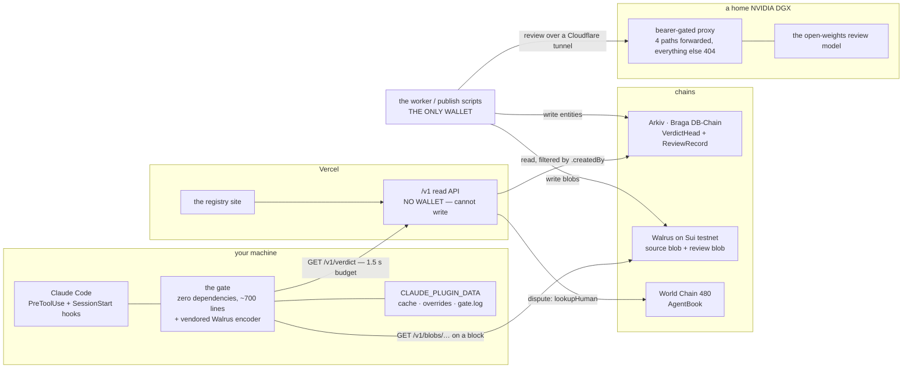

import { Callout } from 'nextra/components';

# Architecture

Five places things run. The important line through all of them: **exactly one process holds a
wallet**, and it is not the one on the hot path.



## The two loops

**The gate loop — milliseconds, on every tool call.** Identify from config, one lookup, decide. It
touches the network at most twice: the verdict, and — only when blocking — the evidence blob. It
never runs an MCP server and never asks one what it is.

**The registry loop — minutes, on submission and on every release.** Source to Walrus, review, review
body to Walrus, head to Arkiv. Nothing in this loop is on anyone's critical path.

## Who can write what

| Process | Wallet | Can write |
|---|---|---|
| the gate, on your machine | none | your local cache and overrides, nothing else |
| the `/v1` API on Vercel | **none** | nothing. There is no `createWalletClient` in it |
| the worker / publish scripts | **one** | Walrus blobs, Arkiv entities |

Every consumer read is filtered by `.createdBy(<that one writer>)`. Braga is a shared public testnet
with no uniqueness constraint on our attributes, so without the filter anyone can write a colliding
fingerprint with `state: clean` and the gate reads *their* verdict. The store refuses to construct
without a valid writer address — there is no unfiltered mode.

## The review model, and why it is behind a proxy

The reviewer runs on a home DGX, so a deployed process reaches it through a Cloudflare tunnel:

```
Vercel  ──►  https://surex-reviewer.santiagodevrel.dev/v1   (Cloudflare tunnel)
             └─►  127.0.0.1:11500   the proxy   (systemd, Restart=always)
                  └─►  127.0.0.1:11434   the model runtime
```

An open model port on a home machine is a free GPU for whoever finds it, so the proxy checks a
bearer token with a constant-time comparison and forwards only the four paths the reviewer actually
calls: chat completions, completions, the model list, and a cheap liveness endpoint. Everything else
is a `404` — notably the pull endpoint, so nobody can make the box download anything. Request bodies
are never logged, because they carry the source code being reviewed.

<Callout type="info">
**The endpoint is swappable and that is the point.** The reviewer speaks plain OpenAI-compatible
chat completions with no vendor-specific field, so `SUREX_REVIEWER_BASE_URL` can be repointed at any
hosted open-weights endpoint. A single physical machine is a single point of failure; a single
*protocol* is not.
</Callout>

The model is the stock coder model with its context capped — not decoration. The stock tag declares
a 262,144-token context, the runtime sizes its KV cache from that, the load reached 112 GiB of 122
GiB and the process was killed mid-load by the out-of-memory reaper. The same weights with the
context capped fit in 50 GiB and load in about ninety seconds.

## Packages

| | |
|---|---|
| `packages/core` | `SXF-1`, the frozen `/v1` contract, `decide()`, the copy law as executable rules, blob verification. **Zero dependencies by rule** |
| `packages/plugin` | the gate, the CLI, the hooks manifest, the vendored Walrus encoder. Also zero dependencies |
| `packages/reviewer` | capability scan, injection scan, the hardened prompt, the double model run, the demo-recovery cache |
| `packages/worker` | the write side. Walrus + Arkiv, the only wallet |
| `packages/fixtures` | fifteen runnable MCP servers — five honest, five ambiguous, five malicious — the only things SureX ever flags |
| `apps/api` | the read path |
| `apps/web` | the registry site |
| `apps/docs` | this site |

`packages/core` is **vendored** into `packages/plugin/lib/core/` by `scripts/sync-core.mjs`, because
a plugin installed from a git repo never runs `npm install`. `pnpm check:sync` fails if the two
copies have drifted, which is what keeps a vendored copy from becoming a fork.

## Deployment

Three Vercel projects out of one repository, each with its own Root Directory: the API, the registry
site, and this documentation site. The API is pinned to the Node runtime deliberately — `node:crypto`,
the Arkiv SDK's transport and JSON import attributes all need it, and the framework's *edge* adapter
and its *node* adapter are one character apart in an import.
